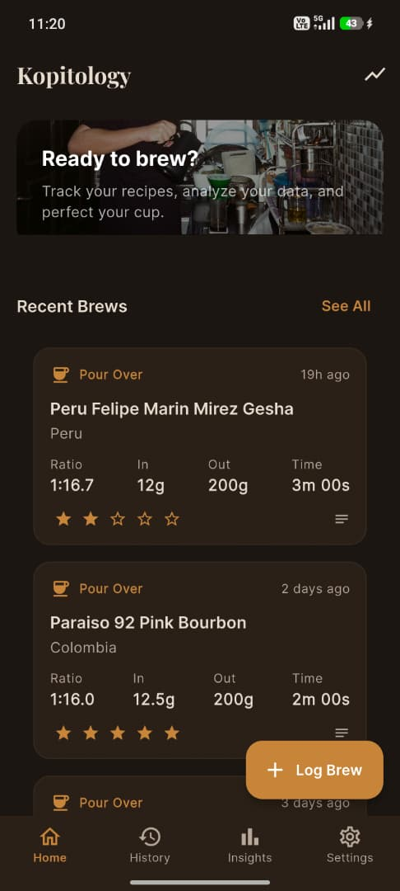
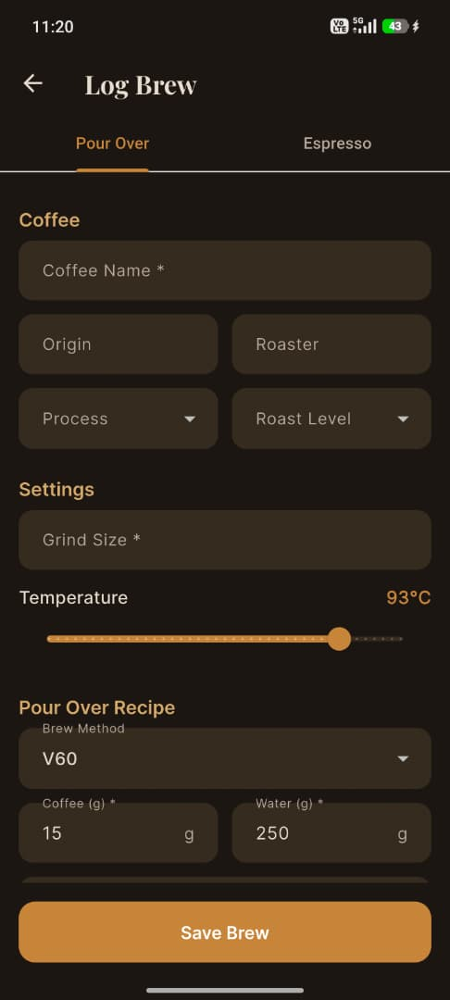
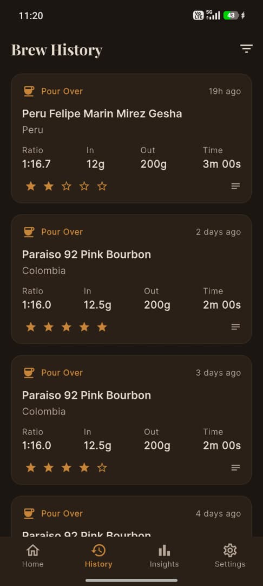
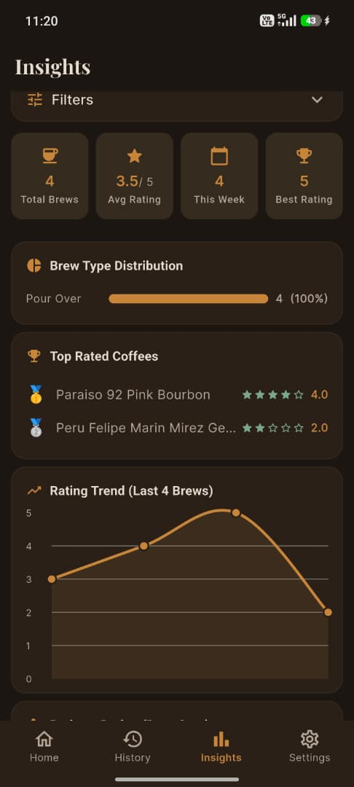

# Coffee Brew Tracker ☕️

A premium, feature-rich mobile application for coffee enthusiasts to track, analyze, and perfect their brewing craft. Whether you're a V60 pour-over purist or an Espresso enthusiast, this app helps you log every detail and gain deep insights into your flavor journey.


## ✨ Features

### 📝 Precision Logging
- **Multi-Method Support**: Specialized forms for **Pour Over** and **Espresso**.
- **Deep Metrics**: Track grind size, temperature, coffee/water weight, brew time, and ratios.
- **Custom Fields**: Log Roaster, Origin, Process, and Roast Level.
- **Sensory Notes**: Add flavor notes and personal ratings (1-5 stars).

### 📊 Advanced Insights
- **Smart Filtering**: Analyze your data by Coffee Name, Origin, Process, or Brew Type.
- **Visual Analytics**: 
  - **Rating Trends**: See how your brews improve over time.
  - **Ratio vs. Rating**: Find your "sweet spot" with scatter plots (g/g).
  - **Distribution**: Visualize your favorite brew methods and top-rated beans.
- **Summary Statistics**: Total brews, average ratings, and weekly activity at a glance.

### 📜 History & Management
- Search and filter your past brews with ease.
- Detailed view for every log.
- Export data for backup or external analysis.

### 🎨 Premium Design
- **Modern UI**: Built with Material 3 principles and Google Fonts (Playfair Display & Inter).
- **Dynamic Themes**: Beautiful Dark and Light modes tailored for coffee lovers.
- **Aesthetic Excellence**: Smooth transitions, glassmorphism elements, and intuitive layouts.

## 🛠 Tech Stack

- **Framework**: [Flutter](https://flutter.dev)
- **State Management**: [Riverpod](https://riverpod.dev)
- **Database**: [Drift](https://drift.simonbinder.eu/) (High-performance SQLite)
- **Charts**: [FL Chart](https://github.com/imaNNeo/fl_chart)
- **Architecture**: Clean Architecture / Feature-first approach

## 🚀 Getting Started

### Prerequisites

- Flutter SDK (Latest Stable)
- Android Studio / VS Code
- Android/iOS Emulator or physical device

### Installation

1. **Clone the repository**
   ```bash
   git clone https://github.com/AmmarJabar/coffee_brew_tracker.git
   ```

2. **Install dependencies**
   ```bash
   flutter pub get
   ```

3. **Generate database code**
   ```bash
   dart run build_runner build --delete-conflicting-outputs
   ```

4. **Run the app**
   ```bash
   flutter run
   ```

## 📸 Screenshots

| Home | Log Brew | History | Insights |
| :---: | :---: | :---: | :---: |
|  |  |  |  |


---

Developed with ❤️ for the coffee community.
